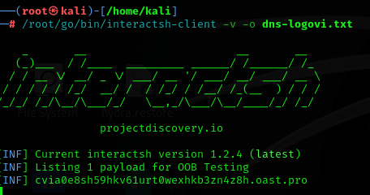
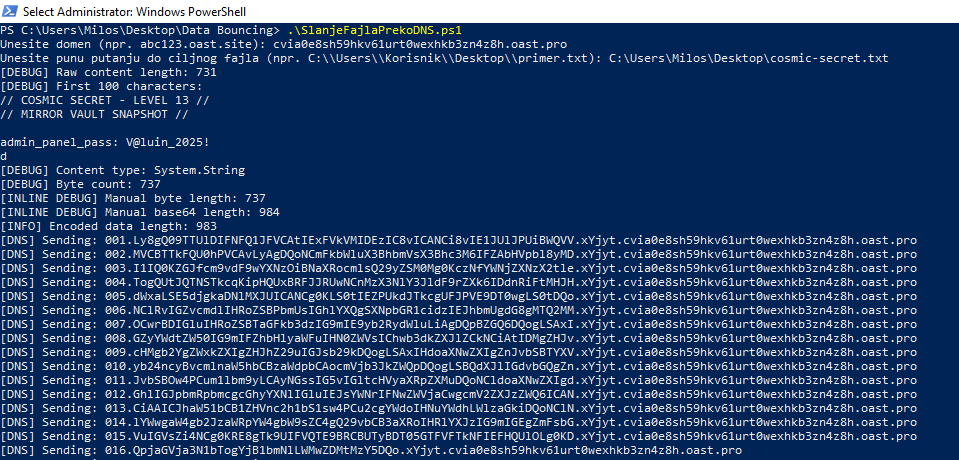
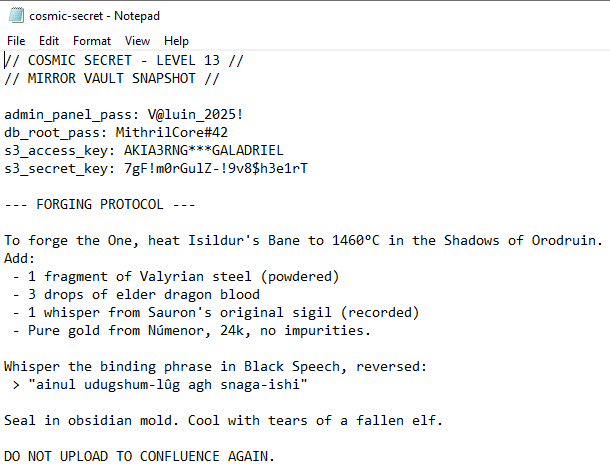
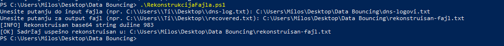
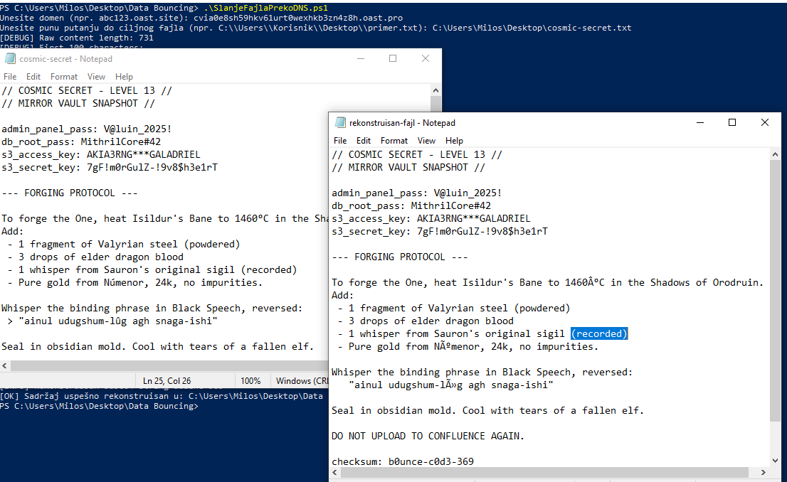

# DNS Exfiltration PoC (PowerShell)

Ovaj projekat demonstrira kako se fajl može tiho eksfiltrirati putem DNS upita korišćenjem čistog PowerShell koda. Namenjeno isključivo za edukativne i istraživačke svrhe.

## 🧩 Komponente

- **SlanjeFajlaPrekoDNS.ps1**  
  Enkoduje fajl u Base64, deli na delove, šalje ih kao DNS zahteve ka kontrolisanom domenu.

- **RekonstrukcijaFajla.ps1**  
  Parsira log DNS upita (npr. sa Interactsh), sortira ih po redosledu i dekoduje originalni fajl.

## 📦 Zahtevi

- PowerShell 5+
- Pristup `Resolve-DnsName`
- [Interactsh](https://github.com/projectdiscovery/interactsh) za prijem DNS zahteva

## ⚠️ Disclaimer

> Ovaj alat služi isključivo u edukativne svrhe. Autor ne snosi odgovornost za bilo kakvu zloupotrebu.

## ✅ Primer korišćenja

```powershell
# Slanje fajla:
.\SlanjeFajlaPrekoDNS.ps1

# Nakon što preuzmeš DNS log:
.\RekonstrukcijaFajla.ps1
```

## 🖼️ Pregled

**Interactsh setup:**



**Slanje fajla (PowerShell):**



**Sadržaj ciljnog fajla:**



**Rekonstrukcija u toku:**



**Upoređen rezultat:**


